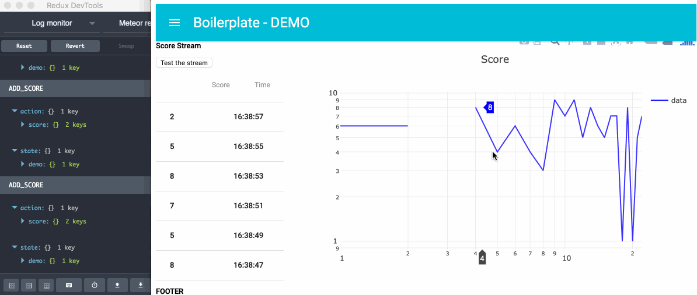

# Meteor react-redux ready to use

For rapid prototyping with a complete react-redux environment



## WHAT INSIDE

Tech:
* backend: Meteor + Express
* frontend: React + Redux
* templating: Material-ui + Flexibox

## HOW TO USE IT
### Get the boilerplate

Depending on how you want to use the boilerplate:
* fork
* or git clone
* or Download ZIP

### Dependency

This boilerplate need meteor installed on your device: [Install meteor](https://www.meteor.com/install)

### Install

```
cd project-folder
```

If you don't want install the demo files please remove the fodler "demo" before:

```
rm -rf demo
```

Then/or

```
sh install.sh
```

### DEMO

[Sub folder here](https://github.com/ClemDelp/react-redux-meteor-boilerplate/tree/master/demo)
* rest-api demo with express
* web socket with streamy
* pure react component
* sagas interaction
* database interaction
* ...

To remove all the demo files:

```
cd project-folder
rm -rf demo
```

Then restart the server

### Launch the server

By default install.sh will lunch the server, in other case simply type:

```
meteor
```

Then in browser:

```
http://localhost:3000
```

### Launch the database

Meteor use Mongo as DB
Open a new terminal with your server running
In this boilerplate by default a 'log' collection is created

```
meteor mongo
db.log.find()
```

With [Robomongo](https://robomongo.org/) create a new connection


then


## THEN

(•_•)...( •_•)>⌐■-■...(⌐■_■) be cool...
