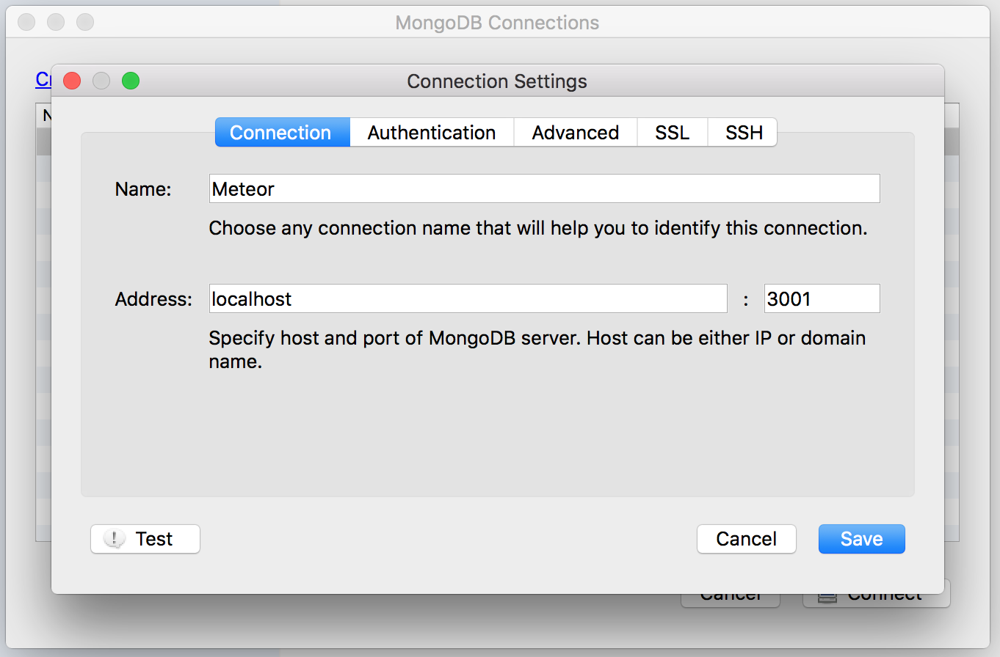
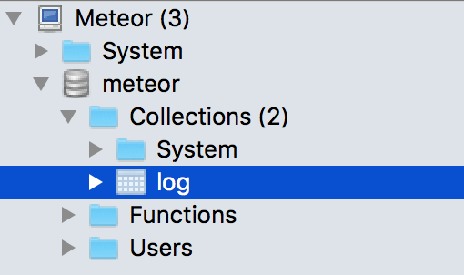

# Meteor react-redux ready to use
For rapid prototyping with a complete react-redux environment

## WHAT INSIDE
Tech:
* backend: Meteor + Express
* frontend: React + Redux
* templating: Material-ui + Flexibox

## HOW TO USE IT
### Get the boilerplate
Depending on how you want to use the boilerplate:
* fork
* or git clone
* or Download ZIP

### Install the dependencies
```
cd project-folder
meteor npm install
```

### Launch the server
```
meteor
```
Then in browser:
```
http://localhost:3000
```
### Launch the database
Meteor use Mongo as DB
Open a new terminal with your server running
In this boilerplate by default a 'log' collection is created
```
meteor mongo
db.log.find()
```
With [Robomongo](https://robomongo.org/) create a new connection



then



### DEMO

* rest-api demo with express
* web socket with streamy
* pure react component
* sagas interaction
* database interaction
* ...

To remove the demo file from the frontend:
```
cd your-project
rm -rf client/demo
```

## THEN

(•_•)...( •_•)>⌐■-■...(⌐■_■) be cool...
