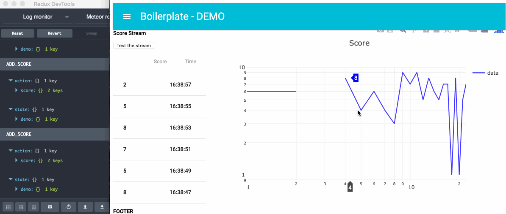

# Meteor react-redux ready DEMO



* rest-api demo with express
* web socket with streamy
* pure react component
* sagas interaction
* database interaction
* ...

To remove the demo file from the frontend:

```
cd your-project
rm -rf client/demo
```

## THEN

(•_•)...( •_•)>⌐■-■...(⌐■_■) be cool...
